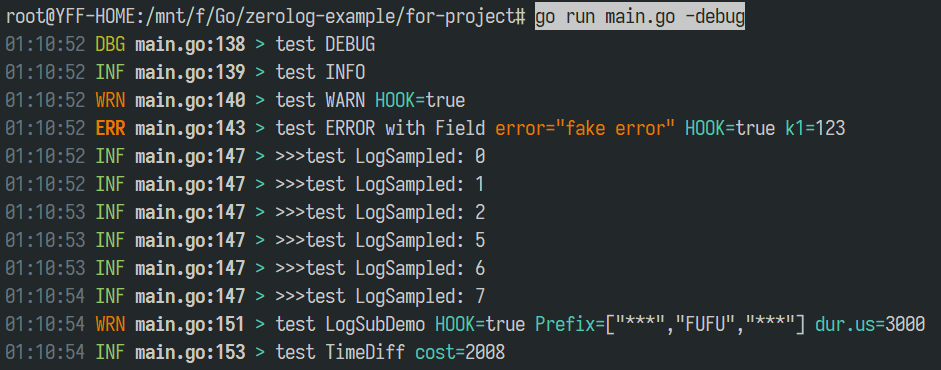

# Zerolog 使用示例

仅供参考, 若对日志性能要求不高, 可以选择: [gxlog](https://github.com/fufuok/gxlog)

## 特征

1. 开发环境时, 日志高亮输出到控制台
2. 生产环境时, 日志输出到文件(可选关闭高亮, 保存最近 10 个 30 天内的日志), 并发送 JSON 日志到 ES
3. 适应配置热加载时更新日志输出模式和日志级别

## 效果

### 1. [basic/basic.go](basic/basic.go)

```shell
16:21:46 DBG basic.go:108 > test DEBUG
16:21:46 INF basic.go:109 > test INFO
16:21:46 WRN basic.go:110 > test WARN
16:21:46 ERR basic.go:113 > test ERROR with Field error="fake error" k1=123
16:21:46 ERR basic.go:118 > test ERROR json.key error="my error msg"
{"level":"error","error":"fake error","error":"my error msg","time":"2021-04-06T16:21:46+08:00","message":"test ERROR json.key"}
16:21:46 INF basic.go:127 > >>>test LogSampled: 0
16:21:46 INF basic.go:127 > >>>test LogSampled: 1
16:21:46 INF basic.go:127 > >>>test LogSampled: 2
16:21:47 INF basic.go:127 > >>>test LogSampled: 5
16:21:47 INF basic.go:127 > >>>test LogSampled: 6
16:21:47 INF basic.go:127 > >>>test LogSampled: 7
16:21:48 WRN basic.go:131 > test LogSubDemo Prefix=["***","FUFU","***"] dur.us=3000
16:21:48 INF basic.go:133 > test TimeDiff cost=2009.8041
```

### 2. [for-project/main.go](for-project/main.go)



```shell
# go run main.go -nocolor
__TO_ES_:{"L":"debug","T":"2021-04-06T16:05:14+08:00","F":"main.go:145","M":"test DEBUG"}
__TO_ES_:{"L":"info","T":"2021-04-06T16:05:14+08:00","F":"main.go:146","M":"test INFO"}
__TO_ES_:{"L":"warn","T":"2021-04-06T16:05:14+08:00","F":"main.go:147","HOOK":true,"M":"test WARN"}
__TO_ES_:{"L":"error","E":"fake error","k1":123,"T":"2021-04-06T16:05:14+08:00","F":"main.go:150","HOOK":true,"M":"test ERROR with Field"}
__TO_ES_:{"L":"error","E":"fake error","error":"my error msg","T":"2021-04-06T16:05:14+08:00","F":"main.go:154","HOOK":true,"M":"test ERROR json.key"}
__TO_ES_:{"L":"info","T":"2021-04-06T16:05:14+08:00","F":"main.go:159","M":">>>test LogSampled: 0"}
__TO_ES_:{"L":"info","T":"2021-04-06T16:05:14+08:00","F":"main.go:159","M":">>>test LogSampled: 1"}
__TO_ES_:{"L":"info","T":"2021-04-06T16:05:15+08:00","F":"main.go:159","M":">>>test LogSampled: 2"}
__TO_ES_:{"L":"info","T":"2021-04-06T16:05:15+08:00","F":"main.go:159","M":">>>test LogSampled: 5"}
__TO_ES_:{"L":"info","T":"2021-04-06T16:05:15+08:00","F":"main.go:159","M":">>>test LogSampled: 6"}
__TO_ES_:{"L":"info","T":"2021-04-06T16:05:16+08:00","F":"main.go:159","M":">>>test LogSampled: 7"}
__TO_ES_:{"L":"warn","Prefix":["***","FUFU","***"],"dur.us":3000,"T":"2021-04-06T16:05:16+08:00","F":"main.go:163","HOOK":true,"M":"test LogSubDemo"}
__TO_ES_:{"L":"info","cost":2013,"T":"2021-04-06T16:05:16+08:00","F":"main.go:165","M":"test TimeDiff"}
```

```shell
# cat app-ff.log
16:05:14 DBG main.go:145 > test DEBUG
16:05:14 INF main.go:146 > test INFO
16:05:14 WRN main.go:147 > test WARN HOOK=true
16:05:14 ERR main.go:150 > test ERROR with Field E="fake error" HOOK=true k1=123
16:05:14 ERR main.go:154 > test ERROR json.key E="fake error" HOOK=true error="my error msg"
16:05:14 INF main.go:159 > >>>test LogSampled: 0
16:05:14 INF main.go:159 > >>>test LogSampled: 1
16:05:15 INF main.go:159 > >>>test LogSampled: 2
16:05:15 INF main.go:159 > >>>test LogSampled: 5
16:05:15 INF main.go:159 > >>>test LogSampled: 6
16:05:16 INF main.go:159 > >>>test LogSampled: 7
16:05:16 WRN main.go:163 > test LogSubDemo HOOK=true Prefix=["***","FUFU","***"] dur.us=3000
16:05:16 INF main.go:165 > test TimeDiff cost=2013
```


*ff*