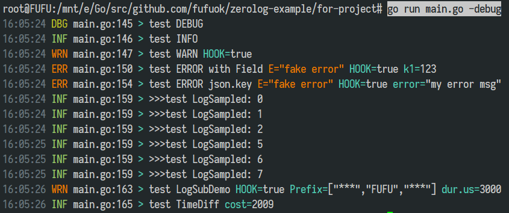

# Zerolog 使用示例

仅供参考, 若对日志性能要求不高, 可以选择: [gxlog](https://github.com/fufuok/gxlog)

## 特征

1. 开发环境时, 日志高亮输出到控制台
2. 生产环境时, 日志输出到文件(关闭高亮, 保存最近 10 个 30 天内的日志), 并发送 JSON 日志到 ES
3. 适应配置热加载时更新日志输出模式和日志级别

## 效果

### 1. [for-project/main.go](for-project/main.go)



```shell
# go run main.go
__TO_ES_:{"level":"debug","time":"2021-04-05T01:10:58+08:00","caller":"main.go:138","msg":"test DEBUG"}
__TO_ES_:{"level":"info","time":"2021-04-05T01:10:58+08:00","caller":"main.go:139","msg":"test INFO"}
__TO_ES_:{"level":"warn","time":"2021-04-05T01:10:58+08:00","caller":"main.go:140","HOOK":true,"msg":"test WARN"}
__TO_ES_:{"level":"error","error":"fake error","k1":123,"time":"2021-04-05T01:10:58+08:00","caller":"main.go:143","HOOK":true,"msg":"test ERROR with Field"}
__TO_ES_:{"level":"info","time":"2021-04-05T01:10:58+08:00","caller":"main.go:147","msg":">>>test LogSampled: 0"}
__TO_ES_:{"level":"info","time":"2021-04-05T01:10:58+08:00","caller":"main.go:147","msg":">>>test LogSampled: 1"}
__TO_ES_:{"level":"info","time":"2021-04-05T01:10:58+08:00","caller":"main.go:147","msg":">>>test LogSampled: 2"}
__TO_ES_:{"level":"info","time":"2021-04-05T01:10:59+08:00","caller":"main.go:147","msg":">>>test LogSampled: 5"}
__TO_ES_:{"level":"info","time":"2021-04-05T01:10:59+08:00","caller":"main.go:147","msg":">>>test LogSampled: 6"}
__TO_ES_:{"level":"info","time":"2021-04-05T01:10:59+08:00","caller":"main.go:147","msg":">>>test LogSampled: 7"}
__TO_ES_:{"level":"warn","Prefix":["***","FUFU","***"],"dur.us":3000,"time":"2021-04-05T01:11:00+08:00","caller":"main.go:151","HOOK":true,"msg":"test LogSubDemo"}
__TO_ES_:{"level":"info","cost":2010,"time":"2021-04-05T01:11:00+08:00","caller":"main.go:153","msg":"test TimeDiff"}
```

```shell
# cat app-ff.log
01:10:58 DBG main.go:138 > test DEBUG
01:10:58 INF main.go:139 > test INFO
01:10:58 WRN main.go:140 > test WARN HOOK=true
01:10:58 ERR main.go:143 > test ERROR with Field error="fake error" HOOK=true k1=123
01:10:58 INF main.go:147 > >>>test LogSampled: 0
01:10:58 INF main.go:147 > >>>test LogSampled: 1
01:10:58 INF main.go:147 > >>>test LogSampled: 2
01:10:59 INF main.go:147 > >>>test LogSampled: 5
01:10:59 INF main.go:147 > >>>test LogSampled: 6
01:10:59 INF main.go:147 > >>>test LogSampled: 7
01:11:00 WRN main.go:151 > test LogSubDemo HOOK=true Prefix=["***","FUFU","***"] dur.us=3000
01:11:00 INF main.go:153 > test TimeDiff cost=2010
```


*ff*